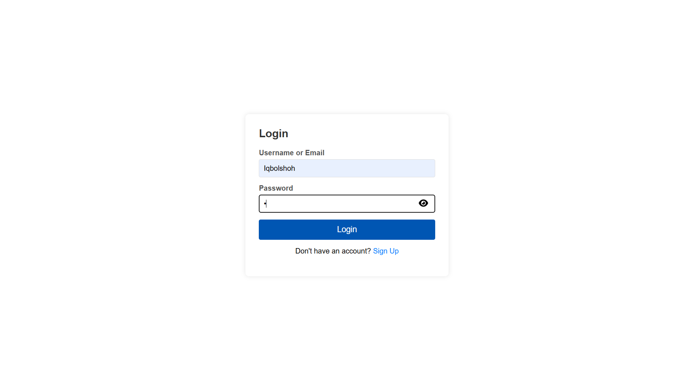
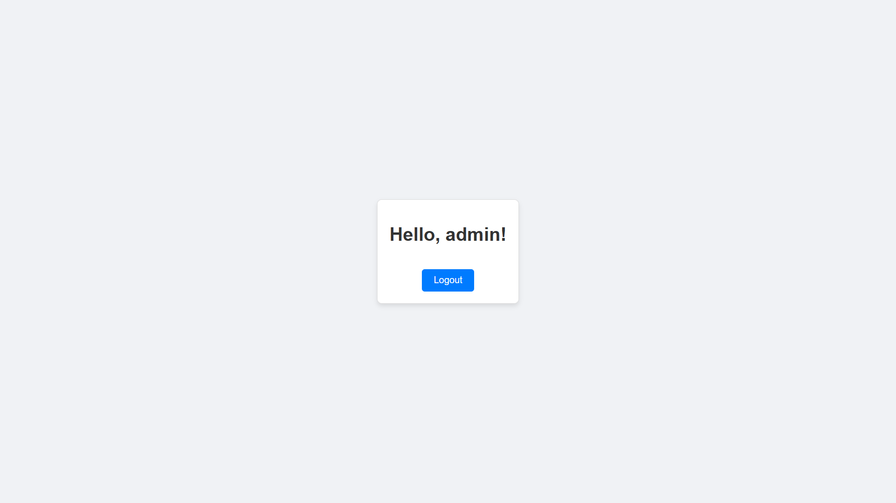

# PHP User Admin Roles

This repository is a user management system built using PHP. It includes functionalities for user registration, login, role management.



## Features

- **User Roles**: Admin, and User roles with specific access controls.
- **User Authentication**: Secure login and registration with password hashing.
- **File Uploads**: Users can upload profile images. All images, except `default.png`, are securely encrypted before storage.
- **Role-Based Access**: Different pages and functionalities accessible based on user roles.

## Preview pages

### Admin Dashboard


### User Dashboard


## Setting Up the Project

1. Clone the repository:
   ```bash
   git clone https://github.com/Iqbolshoh/php-user-admin-roles.git
   cd php-user-admin-roles
   ```

2. Import the database:
   ```bash
   mysql -u yourusername -p yourpassword < database.sql
   ```

3. Configure the database connection in `config.php`:
   ```php
   
   private $conn;

   public function __construct()
   {
       $servername = "localhost";
       $username = "root";
       $password = "";
       $dbname = "roles";
       $this->conn = new mysqli($servername, $username, $password, $dbname);

       if ($this->conn->connect_error) {
           die("Connection failed: " . $this->conn->connect_error);
       }
   }
   ```

## Technologies Used

<div style="display: flex; flex-wrap: wrap; gap: 5px;">
    
    
    
     
   
</div>


## Contributing

Contributions are welcome! If you have suggestions or want to enhance the project, feel free to fork the repository and submit a pull request.


## Connect with Me

I love connecting with new people and exploring new opportunities. Feel free to reach out to me through any of the platforms below:

<table>
    <tr>
        <td>
            <a href="https://github.com/iqbolshoh">
                
            </a>
        </td>
        <td>
            <a href="https://t.me/iqbolshoh_777">
                
            </a>
        </td>
        <td>
            <a href="https://www.linkedin.com/in/iiqbolshoh/">
                
            </a>
        </td>
        <td>
            <a href="https://instagram.com/iqbolshoh_777" target="blank"></a>
        </td>
        <td>
            <a href="https://wa.me/qr/22PVFQSMQQX4F1">
                
            </a>
        </td>
        <td>
            <a href="https://x.com/iqbolshoh_777">
                
            </a>
        </td>
        <td>
            <a href="mailto:iilhomjonov777@gmail.com">
                
            </a>
        </td>
    </tr>
</table>
