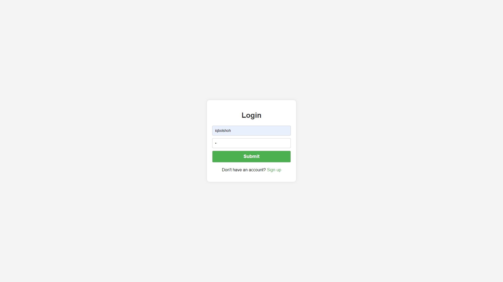
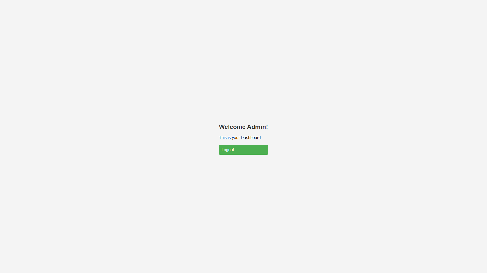
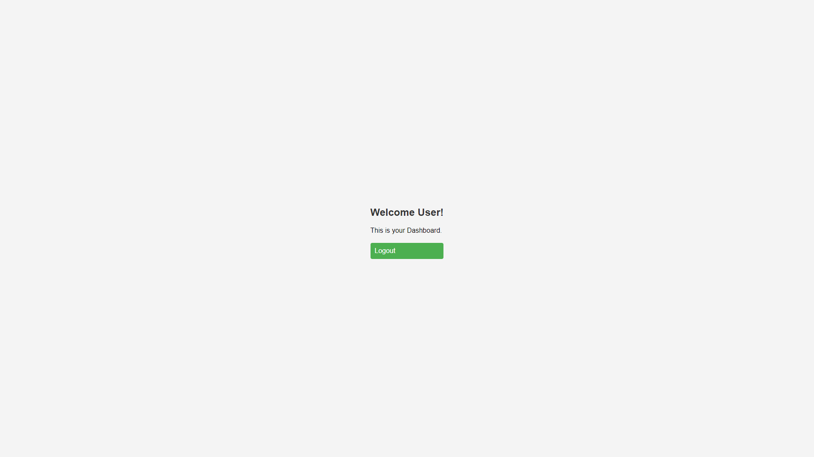
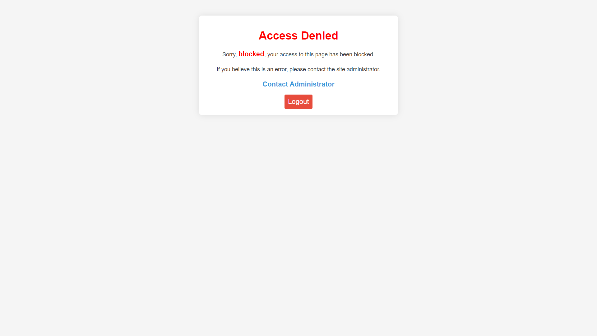

# PHP User Admin Roles

This repository is a user management system built using PHP. It includes functionalities for user registration, login, role management, and user blocking.

## Directory Structure

- `admin/`: Contains `index.php` which is the dashboard for admins.
- `css/`: Contains CSS files for styling different pages.
  - `style.css`: Main stylesheet.
  - `login.css`: Stylesheet for the login page.
  - `blocked_page.css`: Stylesheet for the blocked page.
- `images/`: Contains images used in the application.
  - `favicon.ico`: Favicon for the site.
  - `no_image.png`: Default profile image.
  - `login.png`: Image used in the login page.
  - `admin.png`: Image used in the admin dashboard.
  - `blocked_page.png`: Image used in the blocked page.
- `login/`: Contains `index.php` for user login.
- `logout/`: Contains `index.php` for user logout.
- `signup/`: Contains `index.php` for user registration.
- `blocked_page.php`: Page displayed for blocked users.
- `config.php`: Configuration file containing the `Query` class for database operations.
- `database.sql`: SQL file to set up the database.
- `index.php`: Main homepage.

## Images

### Login Page


### Admin Dashboard


### User Dashboard


### Blocked Page


## Database Schema

The database contains a table named `accounts` with the following structure:

```sql
CREATE TABLE IF NOT EXISTS accounts (
    id INT AUTO_INCREMENT PRIMARY KEY,
    name VARCHAR(30) NOT NULL,
    number VARCHAR(20) NOT NULL UNIQUE,
    email VARCHAR(255) NOT NULL UNIQUE,
    username VARCHAR(255) NOT NULL UNIQUE,
    password VARCHAR(255) NOT NULL,
    role VARCHAR(20) NOT NULL DEFAULT 'user',
    profile_image VARCHAR(255) DEFAULT 'no_image.png',
    status ENUM('active', 'blocked') NOT NULL DEFAULT 'active',
    registration_date TIMESTAMP DEFAULT CURRENT_TIMESTAMP
);
```

## Usage

### Admin Panel

The admin panel is accessible via `admin/index.php`. Only users with the role of 'admin' can access this page.

### User Registration

Users can register via `signup/index.php`. They can register either as a regular user or an admin.

### User Login

Users can log in via `login/index.php`.

### User Logout

Users can log out via `logout/index.php`.

### Blocked Users

Blocked users are redirected to `blocked_page.php`.

### Configuration

The `config.php` file contains the `Query` class which handles all database operations.

## Setting Up the Project

1. Clone the repository:
   ```bash
   git clone https://github.com/Iqbolshoh/php-user-admin-roles.git
   cd php-user-admin-roles
   ```

2. Import the database:
   ```bash
   mysql -u yourusername -p yourpassword < database.sql
   ```

3. Configure the database connection in `config.php`:
   ```php
   // Example configuration
   private $conn;

   public function __construct()
   {
       $servername = "localhost";
       $username = "root";
       $password = "";
       $dbname = "Roles";
       $this->conn = new mysqli($servername, $username, $password, $dbname);

       if ($this->conn->connect_error) {
           die("Connection failed: " . $this->conn->connect_error);
       }
   }
   ```

## Features

- **User Roles**: Admin, and User roles with specific access controls.
- **User Authentication**: Secure login and registration with password hashing.
- **User Blocking**: Blocked users are redirected to a specific page.
- **File Uploads**: Users can upload profile images. All images, except `no_image.png`, are securely encrypted before storage.
- **Role-Based Access**: Different pages and functionalities accessible based on user roles.

## Technologies Used

- PHP 
- MySQL 
- HTML 
- CSS 
- JavaScript 

## Contributing

Contributions are welcome! Please fork the repository and submit a pull request.

## Connect with Me

I love connecting with new people and exploring new opportunities. Feel free to reach out to me through any of the
platforms below:

<table>
    <tr>
        <td>
            <a href="https://t.me/iqbolshoh_777">
                
            </a>
        </td>
        <td>
            <a href="https://instagram.com/iqbolshoh_777" target="blank"></a>
        </td>
        <td>
            <a href="https://wa.me/qr/22PVFQSMQQX4F1">
                
            </a>
        </td>
        <td>
            <a href="https://x.com/iqbolshoh_777">
                
            </a>
        </td>
        <td>
            <a href="https://www.linkedin.com/in/iqbolshoh/">
                
            </a>
        </td>
        <td>
            <a href="mailto:iilhomjonov777@gmail.com">
                
            </a>
        </td>
    </tr>
</table>
